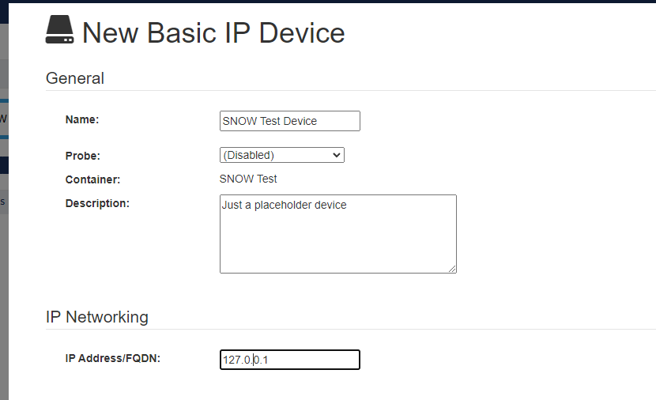

# Proof of Concept - MPA Integration with Service Now
# Overview
This project provides an example application of the Mitel Performance Analytics API.  The example MPA_TO_SNOW.py uses the MPA rest API to retrieve alarms from MPA, apply rules to them, and create ServiceNow incidents that hyperlinked in both directions for easy navigation.
# Pre-requisites
## MPA Development System
in order to run these examples, you need to have valid credentials for an MPA system, including an MPA container that you can experiment on.  For example:
- a lab system
- a staging system (non production)
- a container with non-production device(s) in it.
## Development Client Environment
These examples run in a python environment on the developers computer.  The examples do not include strategies for running similar programs in a persistent production environment.  You need to have python version 3 installed on this environment.
There is a Visual Studio code project included in the repository.   The easiest way to run the examples is to open the mpa_api_examples folder in VS Code.

# Installing - VS Code
With the pre-requisites installed:
## Clone the repository
```
git clone git@github.com:martellotech/mpa_api_examples.git
```
## Open the project in VS Code
## Create a python virtual environment
- CTRL-Shift-P - "Python: Create Environment"
  - choose include "requirements.txt"
## Create a test MPA environment
### Create a container called "SNOW Test" or similar.

In this example the container GUID is 401ff9d6-1c4e-4e2a-8f59-70471e048b7f.   You will need your container GUID to configure the api, below.

### Create a "Basic IP" device called "SNOW Test Device" or similar.

You don't need (or want) a probe configured for this device.

## Create your .env file
In the working directory create a file called ".env".   It needs to include:
```
MPA_HOST=<your mpa host system FQDN>
MPA_UID=<the user id you will use for the API.  You could create a new one like "mpa_api@yourdomain.com", or use an existing account>
MPA_PW=<the password for this account>
MPA_CONTAINER=<the container GUID for the container whose alarms you will be mapping>
SNOW_HOST=<the FQDN for your SericeNow system>
SNOW_UID=<The user id that will be used to create new incidents.  You could create a new one for "mpa_api@yourdomain.com" or use an existing account>
SNOW_PW=<the password for this account>
```
if you run:
```
echo.>.env
python api/API_Config.py
```
it will prompt you for each of these items.
# Run MPA_TO_SNOW.py
- choose the file in VS Code, and pick "Run->Start Without Debugging" from the menu.
- The example includes three rules for creating ServiceNow incidents from MPA Alarms.  They are
 - favorite alarms (star button in the MPA UI)
 - user assigned alarms with no ticket assigned.
 - recent critical alarms (less than 1 hr old)
## Favorite alarm.
- On the "No probe configured" alarm press the star button.   within 15s you should see an incident number populated in the alarm list.
## Create some new alarms
- Navigate to https://\<MPA_HOST\>/central/rest/devices/\<SNOW Test Device GUID\>/html


- Select "Critical" Severity, and type an "TEST CRITICAL" into Text.
- press create alarm.
- Change the Source, for example to "testSNOW", type "TEST ASSIGN" into Text, change severity to Major, and press Create Alarm
- Navigate back to the device dashboard.
- Press the "Assign to me" button next to the TEST ASSIGN alarm.   You will see your user name added to the assignee field.
- Within 15s all of the alarms should have SNOW incident hyperlinks.
- If you click on one of the links it should take you to the created incident:


- Clicking on the hyperlink in the incident will take you back to the device dashboard.

